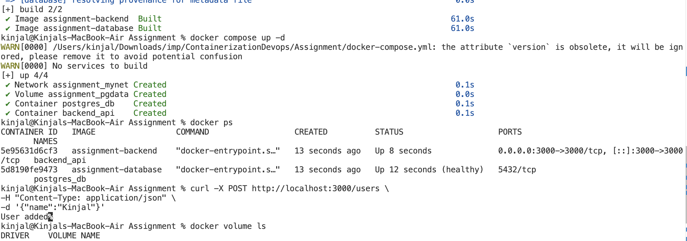
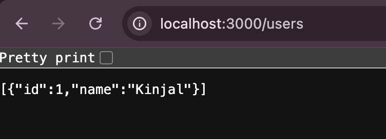
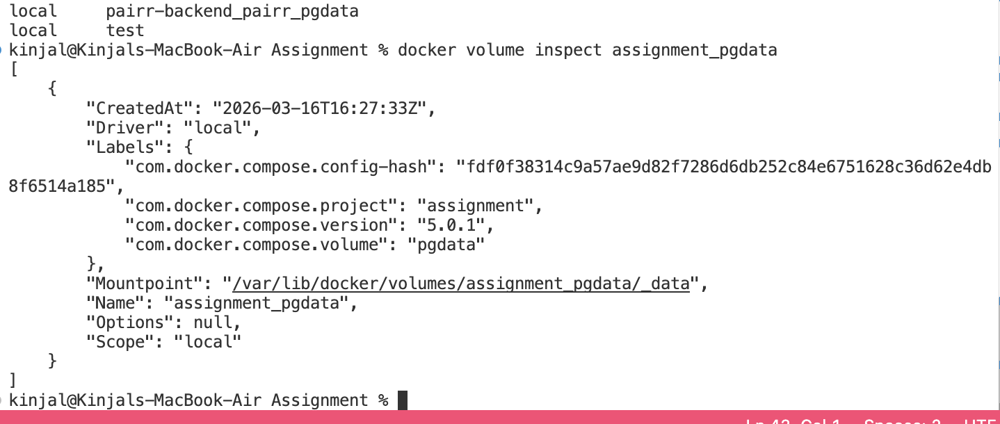
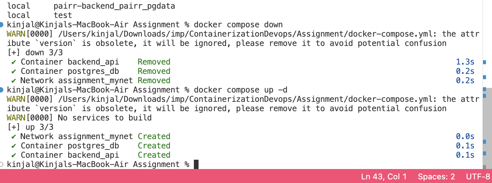
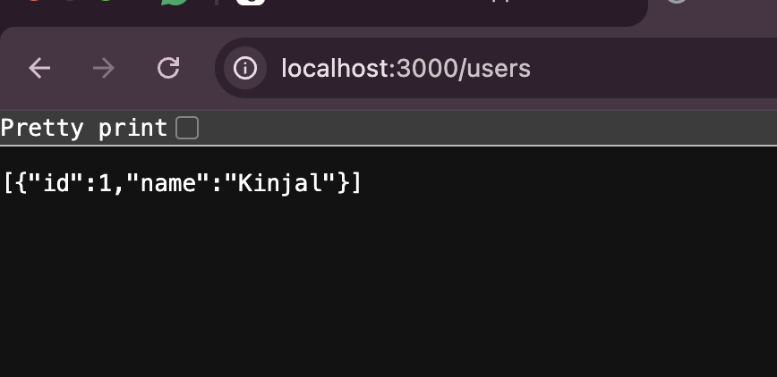
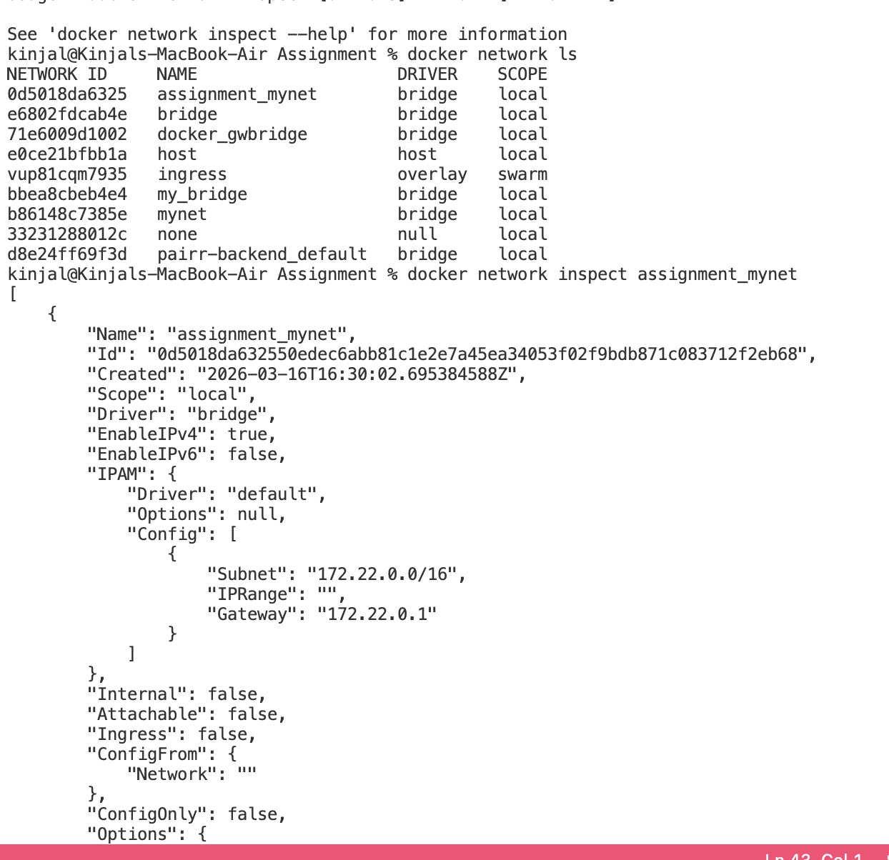

# Containerized Web Application with PostgreSQL

## Project Overview

This project demonstrates a containerized web application using **Node.js (Express)** as the backend API and **PostgreSQL** as the database. The application is fully containerized using **Docker** and orchestrated using **Docker Compose**.

The system showcases production-ready container practices including:

- Multi-stage Docker builds
- Separate Dockerfiles for backend and database
- Docker Compose service orchestration
- Persistent storage using Docker volumes
- Container networking
- Environment variable configuration

---

# Architecture

Client applications (browser or Postman) communicate with the backend API, which then interacts with the PostgreSQL database.

```
Client (Browser / Postman)
        │
        ▼
Backend Container (Node.js + Express)
        │
        ▼
PostgreSQL Container
        │
        ▼
Named Docker Volume (Persistent Storage)
```

---

# Technology Stack

### Backend

- Node.js
- Express.js
- PostgreSQL driver (`pg`)

### Database

- PostgreSQL

### DevOps Tools

- Docker
- Docker Compose

---

# Project Structure

```
containerized-app
│
├── backend
│   ├── Dockerfile
│   ├── server.js
│   └── package.json
│
├── database
│   └── Dockerfile
│
├── docker-compose.yml
├── .dockerignore
└── README.md
```

---

# Backend API Endpoints

### Health Check

```
GET /health
```

Response:

```
OK
```

---

### Insert Record

```
POST /users
```

Example request:

```
{
  "name": "Kinjal"
}
```

### Fetch Records

```
GET /users
```

Returns all stored users from the database.

---

# Docker Implementation

## Multi-Stage Build

The backend Dockerfile uses a **multi-stage build** to optimize the final image size by separating the build environment from the runtime environment.

Advantages:

- Smaller Docker images
- Improved security
- Faster container startup

---

## Persistent Storage

PostgreSQL data is stored using a **named Docker volume**:

```
pgdata:/var/lib/postgresql/data
```

This ensures that database data remains intact even if containers are stopped or removed.

---

# Running the Project

## 1. Clone the Repository

```
git clone <your-repository-url>
cd containerized-app
```

---

## 2. Build Docker Images

```
docker compose build
```

---

## 3. Start Containers

```
docker compose up -d
```

---

## 4. Verify Running Containers

```
docker ps
```

Expected containers:

- backend_api
- postgres_db

---



# Testing the API

### Health Check

```
http://localhost:3000/health
```

---


### Insert Data

```
curl -X POST http://localhost:3000/users \
-H "Content-Type: application/json" \
-d '{"name":"Kinjal"}'
```

---

### Fetch Data

```
curl http://localhost:3000/users
```

---



# Volume Persistence Test

Check volumes:

```
docker volume ls
```



Stop containers:

```
docker compose down
```

Restart containers:

```
docker compose up -d
```

Database records will still exist, confirming persistent storage.

---




# Network Configuration

Containers communicate using a **Docker bridge network** defined in `docker-compose.yml`.

This allows services to communicate using service names instead of IP addresses.

Example:

```
DB_HOST=database
```

---



# Key Learning Outcomes

- Understanding containerized application architecture
- Using Docker for building and running applications
- Implementing multi-stage Docker builds
- Managing container networking
- Persisting data with Docker volumes
- Service orchestration using Docker Compose

---
