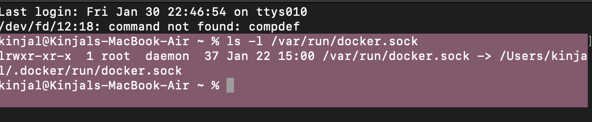
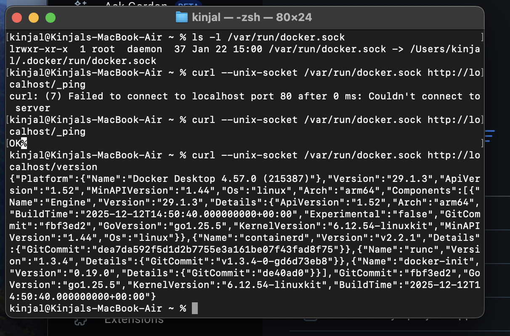
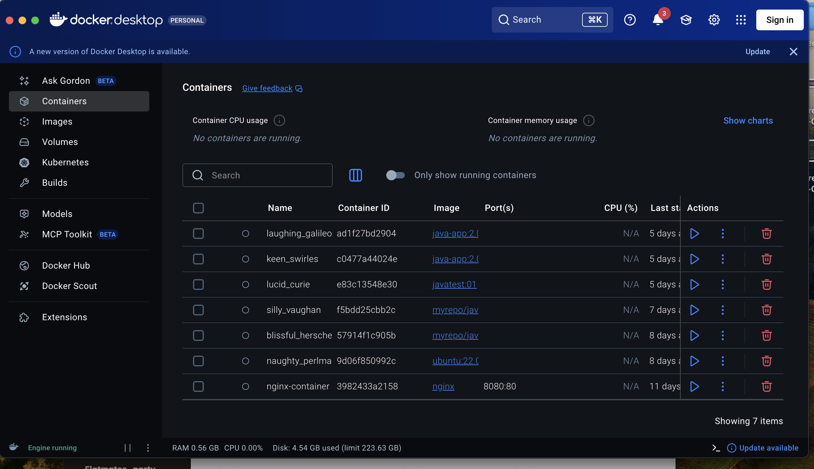

# Translation of Docker CLI Commands to Docker Engine API

This document explains how common Docker command-line operations correspond to requests made to the Docker Engine REST API. Understanding this translation helps when working with Docker programmatically or integrating Docker into custom tools.





## Overview

Docker provides:

- **Docker CLI** — the command-line tool (`docker run`, `docker ps`, etc.)
- **Docker Engine API** — a REST API that the CLI uses internally

Every Docker CLI command is translated into one or more HTTP requests sent to the Docker daemon.

---

## Docker Architecture Simplified

User → Docker CLI → Docker Engine API → Docker Daemon → Containers/Images

The Docker CLI is just a client. The real work is done by the Docker daemon via its API.

---

## Enabling Docker API Access

By default, Docker communicates over a Unix socket:

**Docker CLI**

```bash
docker ps


Docker API

GET /containers/json

```

| Docker CLI Command | Docker API Endpoint                                       |
| ------------------ | --------------------------------------------------------- |
| `docker ps`        | `GET /containers/json`                                    |
| `docker pull`      | `POST /images/create`                                     |
| `docker run`       | `POST /containers/create` + `POST /containers/{id}/start` |
| `docker logs`      | `GET /containers/{id}/logs`                               |
| `docker rm`        | `DELETE /containers/{id}`                                 |
