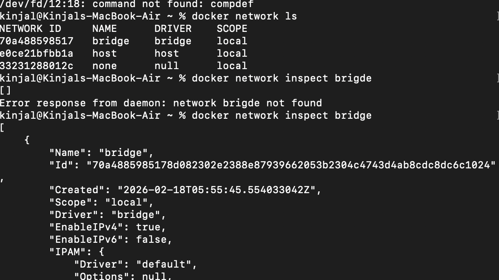
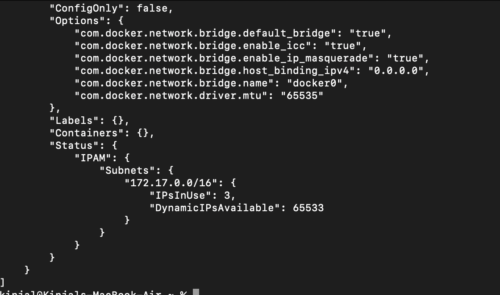
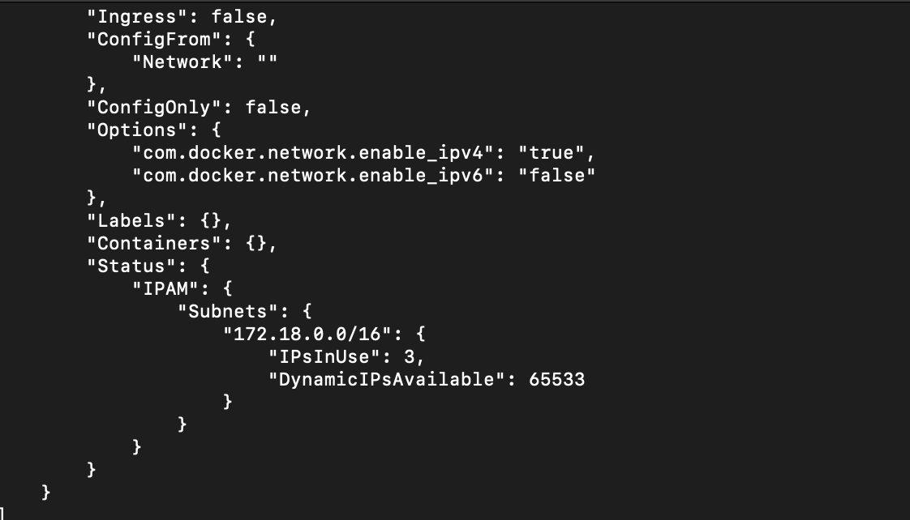
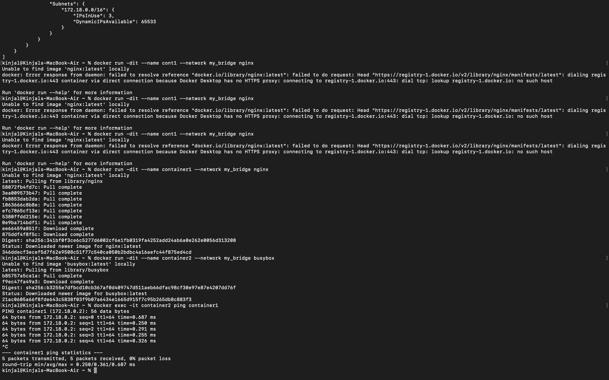
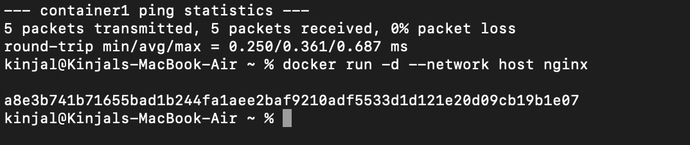

# Networking in Docker – Fundamentals

## Overview

Docker networking enables containers to communicate:

- With other containers
- With the host machine
- With external systems

Docker provides multiple **network drivers** to support different use cases such as isolation, cross-host communication, and direct host access.

---

# Docker Network Drivers

Docker supports the following core network drivers:

## 1. Bridge (Default)

- Default network driver
- Used for standalone containers
- Containers communicate via an internal virtual bridge
- Isolated from host unless ports are published

**Best for:** Single-host container communication

---

## 2. Host

- Container shares the host’s networking namespace
- No network isolation
- No port mapping required
- Faster (no NAT)

**Note:** On macOS and Windows, host mode behaves differently because Docker runs inside a VM.

**Best for:** Performance-critical Linux deployments

---

## 3. None

- Disables all networking
- Container has no external access

**Best for:** Fully isolated workloads

---

## 4. Overlay

- Used in Docker Swarm
- Enables communication across multiple Docker hosts

**Best for:** Multi-host distributed applications

---

## 5. Macvlan

- Assigns a MAC address to container
- Container appears as a physical device on the network

**Best for:** Advanced network setups

---

# Inspecting Docker Networks

## List Available Networks

```bash
docker network ls
```

## Inspect a Network

```bash
docker network inspect bridge
```

---

# Creating a Custom Bridge Network

## Step 1: Create Network

```bash
docker network create my_bridge_network
```

## Step 2: Verify Creation

```bash
docker network ls
```

## Step 3: Run Containers in Custom Bridge

```bash
docker run -dit --name container1 --network my_bridge_network nginx
docker run -dit --name container2 --network my_bridge_network nginx
```

## Step 4: Test Communication Between Containers

Access container1:

```bash
docker exec -it container1 bash
```

Ping container2:

```bash
ping container2
```

If packets are received successfully, networking is working correctly.

---

# Publishing Ports (Bridge Mode)

To expose a container port to the host:

```bash
docker run -d -p 8080:80 nginx
```

This maps:

Host Port 8080 → Container Port 80

Access in browser:

```
http://localhost:8080
```

---

# Checking Open Ports

## On Linux

```bash
ss -tulnp
```

## On macOS

```bash
lsof -i :80
```

---

# Docker Networking Architecture (Bridge Mode)

- Docker creates a virtual interface called `docker0`
- Containers receive private IP addresses
- Docker uses NAT for external communication
- Port publishing enables host-to-container access

# Space for Screenshots

## 1. Listing Networks



---

## 2. Inspecting Bridge Network



---

## 3. Container Ping Test




---

## 4. Checking Open Ports





---

# Key Takeaways

- Bridge is the default and most commonly used network driver.
- Custom bridge networks allow automatic DNS resolution between containers.
- Host mode removes network isolation (fully supported on Linux).
- Overlay networks are used for multi-host communication.
- Port publishing is
