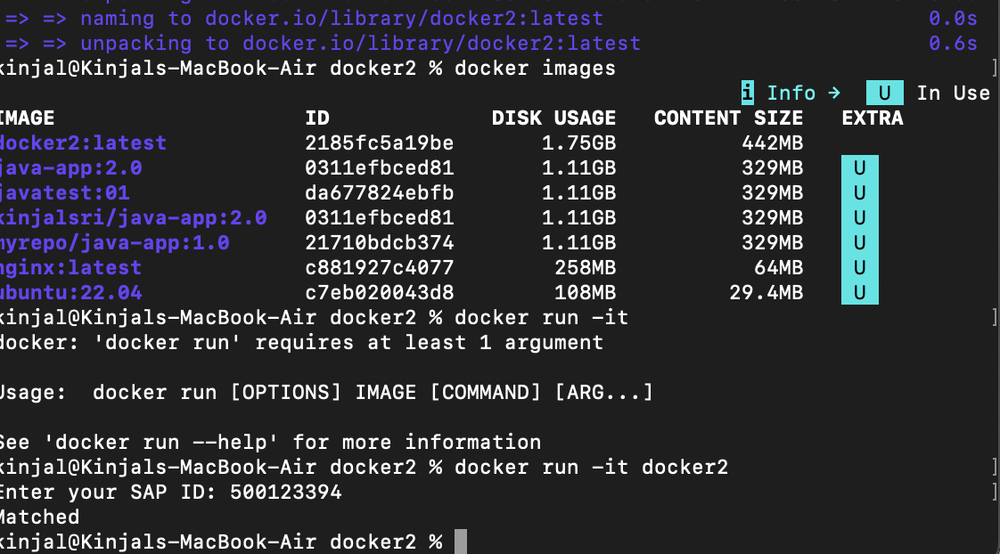
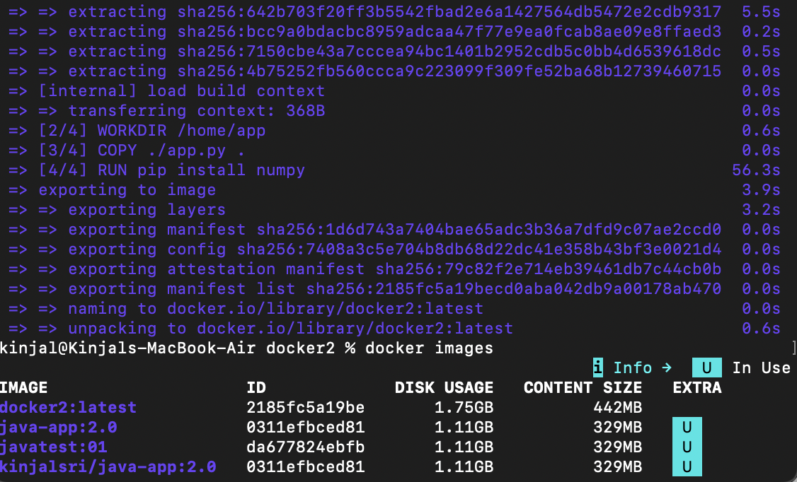
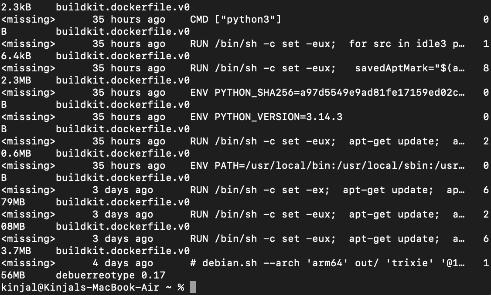
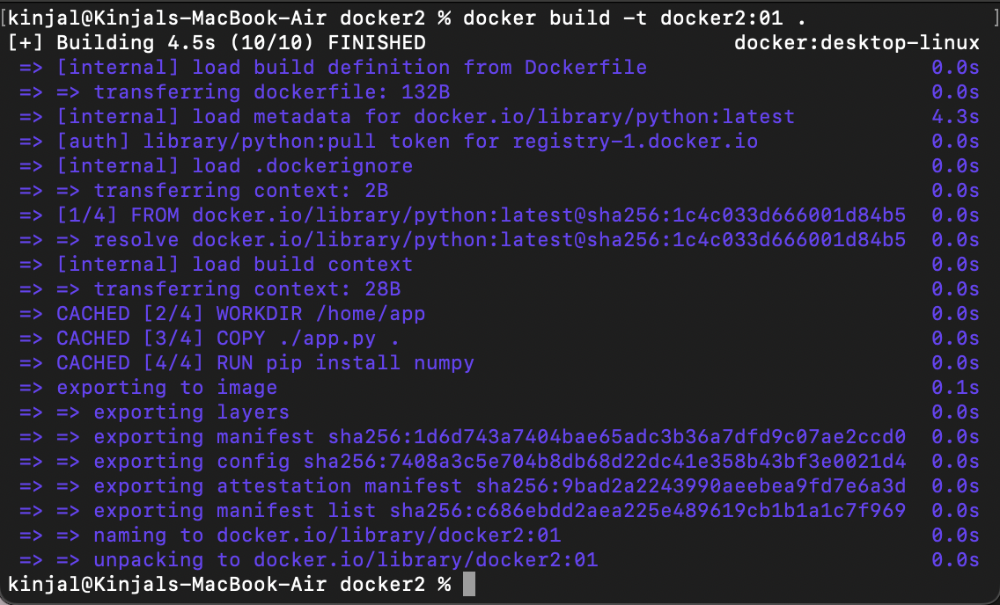

# Building and Running a Python App with Docker

This guide explains how to create a Docker image for a Python application, how Docker layers work, and how to run the container.

## Project Structure

project-folder/
│── Dockerfile
│── app.py

## Dockerfile Used

```dockerfile
FROM python

WORKDIR /home/app
COPY ./app.py .

RUN pip install numpy

CMD ["python", "app.py"]

```

#### 1. FROM python

This is the base image.
Docker pulls an official Python image from Docker Hub.
This layer contains:

Linux OS

Python installed

Every Docker image starts with a base image.

#### 2. WORKDIR /home/app

Sets the working directory inside the container.
If the folder does not exist, Docker creates it.

All future commands will run inside /home/app.

#### 3. COPY ./app.py .

Copies app.py from your local system into the container's working directory.

This creates a new layer that includes your application code.

#### 4. RUN pip install numpy

Executes a command during image build.
This installs the numpy package inside the container.

This creates another layer containing installed dependencies.

Important: If this line changes, Docker rebuilds this layer and all layers after it.

#### 5. CMD ["python", "app.py"]

Specifies the default command to run when a container starts.

This does not create a layer.
It only defines what runs when the container launches.

### Screenshots :







### What Are Docker Layers?

Each instruction in a Dockerfile creates a layer (except CMD).

Layers help Docker:

Cache steps for faster rebuilds

Reuse unchanged parts

Reduce image size using shared layers

Layer Order in This Image

Base Python image

Working directory creation

Copying app.py

Installing numpy

If you only change app.py, Docker reuses earlier layers and rebuilds only from the COPY step onward.

#### Viewing Docker Layers

To see the layers of your image:

```bash
docker history python-numpy-app
```

This shows each instruction and its size contribution.

### Key Takeaways

Docker images are built in layers

Each Dockerfile command (except CMD) creates a layer

Layers make builds faster and efficient

COPY and RUN commands affect rebuild time the most
