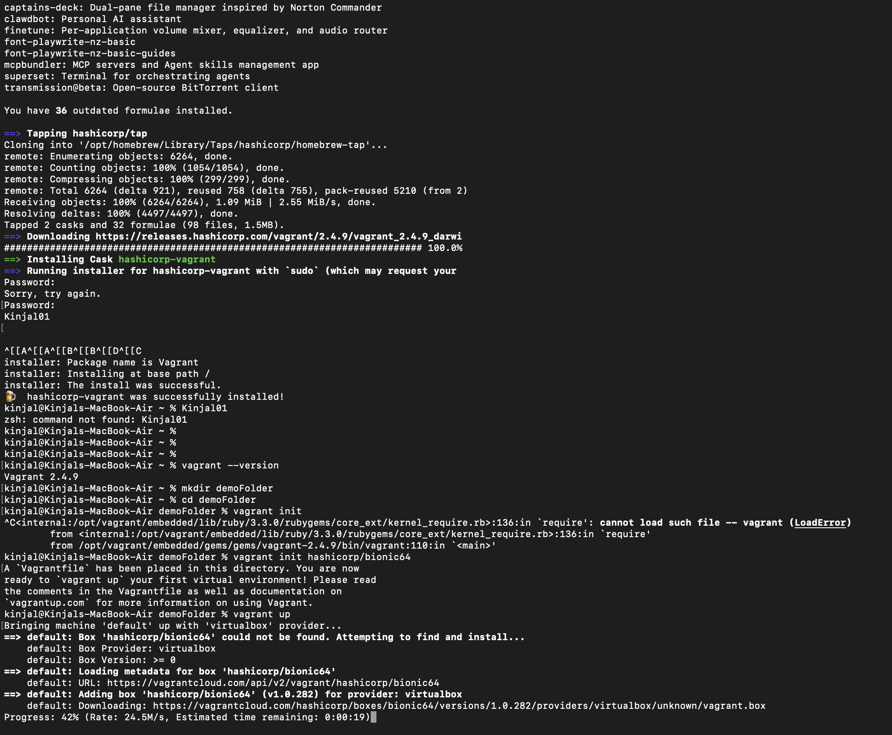

# Lab 1: Performance Comparison of Vagrant VM and Docker for NGINX Server

## 📌 Objective

To compare the **performance time** required to deploy an **NGINX web server** using a **Vagrant-based Virtual Machine** and a **Docker container**, and analyze the efficiency of both approaches.

---

## 🛠️ Technologies Used

- Vagrant
- VirtualBox
- Docker
- NGINX
- Ubuntu

---

## 🧪 Experiment Overview

This experiment evaluates the deployment performance of NGINX using two virtualization techniques:

- **Virtual Machine (Vagrant)**
- **Containerization (Docker)**

The comparison is based on **startup time, deployment speed, and resource efficiency**.

---

## ⏱️ Performance Summary

### Vagrant Virtual Machine

### Docker Container

---

## 📊 Comparison Table

| Parameter          | Vagrant VM | Docker |
| ------------------ | ---------- | ------ |
| Deployment Time    |            |        |
| Startup Speed      | Slow       | Fast   |
| Resource Usage     | High       | Low    |
| Lightweight        | No         | Yes    |
| Overall Efficiency |            |        |

---

### Vagrant VM

- NGINX Server Running on Vagrant  
  

### Docker

- NGINX Server Running on Docker  
  

---

## Result

The Docker-based deployment of NGINX required **significantly less time** compared to the Vagrant Virtual Machine, demonstrating the performance advantage of containerization.

---

## Conclusion

Docker provides faster deployment and better resource utilization than traditional virtual machines. This makes Docker more suitable for modern DevOps environments where speed and scalability are critical.

---
