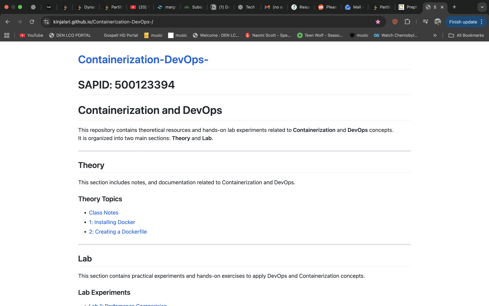

# Installing Docker and Making Github.io Live

This project documents the complete setup process for:

- Installing and configuring Docker
- Running containers and testing the environment
- Hosting a static website using GitHub Pages

It serves as a beginner-friendly guide to containerization and basic web deployment.

---

## Part 1: Installing Docker

Docker allows applications to run inside lightweight, portable containers.

### Step 1: Install Docker

#### macOS

1. Visit the official Docker website
2. Download **Docker Desktop for Mac**
3. Open the `.dmg` file and drag Docker to Applications
4. Launch Docker Desktop and wait until it shows Docker is running

#### Windows

1. Download **Docker Desktop for Windows**
2. Install the application and restart if prompted
3. Open Docker Desktop and ensure it is running

#### Ubuntu / Linux

bash
sudo apt update
sudo apt install docker.io -y
sudo systemctl start docker
sudo systemctl enable docker
docker --version

### Step 2: Verify Docker Installation

Run a test container:

docker run hello-world

If Docker is installed correctly, a confirmation message will be displayed.

### Step 3: Run an Ubuntu Container

docker run -it ubuntu:22.04 bash

This starts an interactive Ubuntu terminal inside a Docker container where you can execute Linux commands.

### Step 4: Install Java Inside the Container (Example)

Inside the Ubuntu container:

apt update
apt install default-jdk -y
java -version

Create a Java file:

nano Hello.java

Add the following code:

```java
class Hello {
    public static void main(String[] args) {
        System.out.println("Hello from Docker!");
    }
}
```

Compile and run:

```bash
javac Hello.java
java Hello
```

## Part 2: Hosting a Website with GitHub Pages

GitHub Pages allows you to host static websites directly from a GitHub repository.

### Step 1: Create a Repository

1. Go to GitHub
2. Click **New Repository**
3. Name the repository exactly:

The repository name must match your GitHub username exactly for the site to work.

---

### Step 2: Add Website Files

Upload your website files such as:

- `index.html`
- `style.css`
- `script.js`

Or push your project using Git from your local machine:

```bash
git init
git add .
git commit -m "Initial website"
git branch -M main
git remote add origin https://github.com/yourusername/yourusername.github.io.git
git push -u origin main
```

### Step 3: Enable GitHub Pages

Open your repository on GitHub

Click on Settings

Scroll down and click Pages from the left sidebar

Under Branch, select:

Branch: main

Folder: /root

Click Save

Step 4: Access the Live Website

After a few minutes, your website will be live at:

https://yourusername.github.io

If the site does not appear immediately, wait a few minutes and refresh the page.


