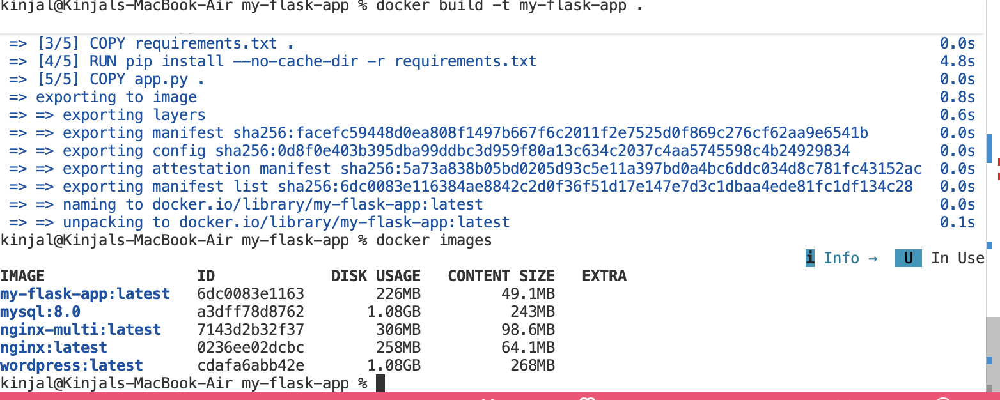
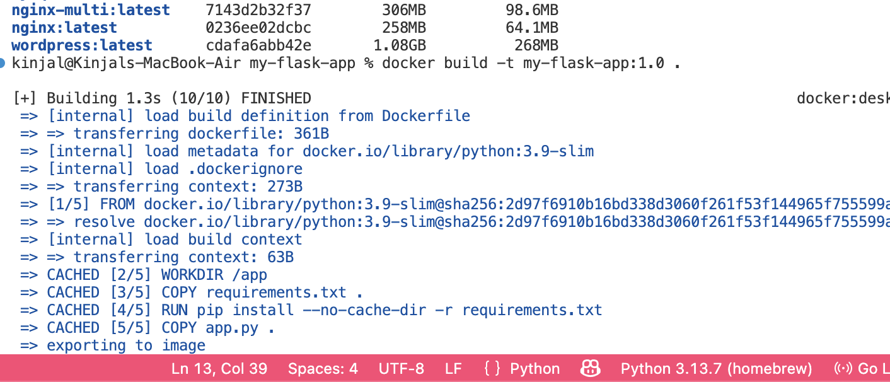
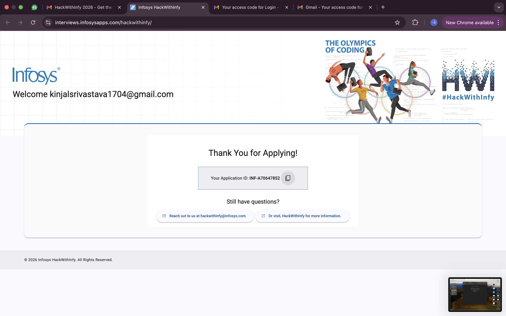
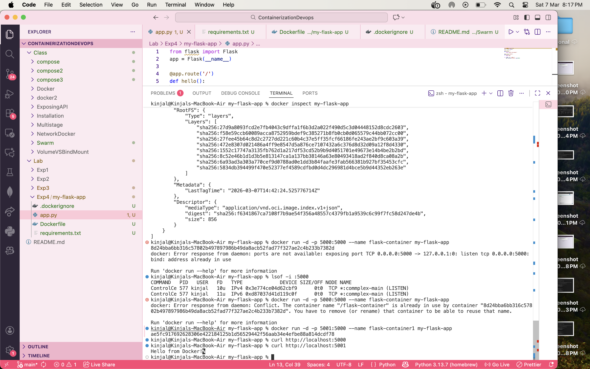
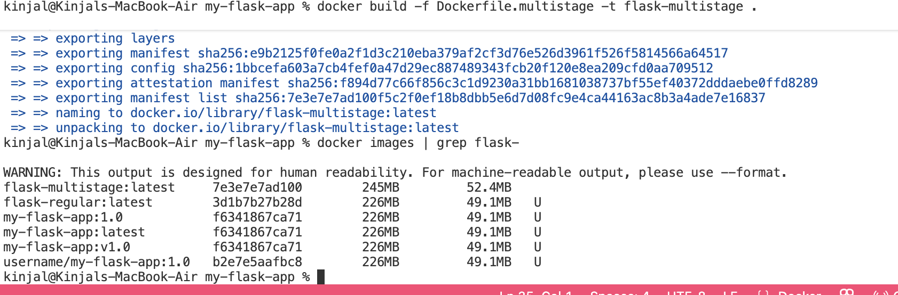
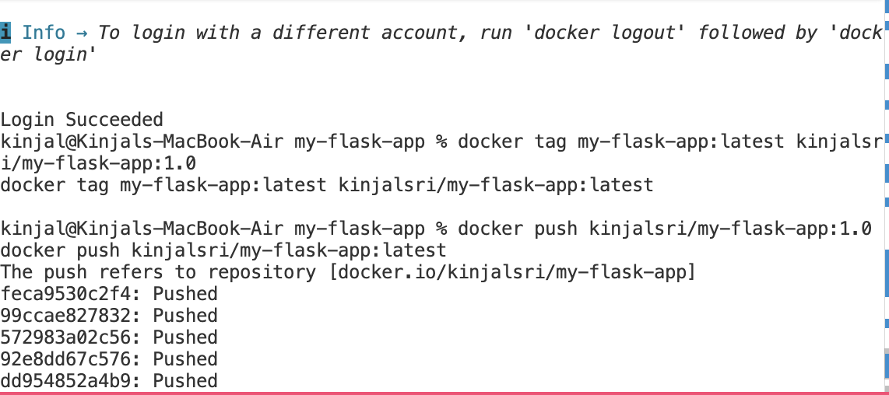

# Experiment 4: Docker Essentials – Containerizing a Flask Application

## Objective

The objective of this experiment is to understand the basics of containerization using Docker by packaging a simple Python Flask application into a Docker container. This experiment demonstrates how Docker simplifies application deployment by creating a consistent runtime environment.

---

## Tools & Technologies

- Python 3
- Flask
- Docker
- Dockerfile
- Terminal / Command Line

---

## Project Structure

```
my-flask-app/
│
├── app.py
├── requirements.txt
├── Dockerfile
├── .dockerignore
└── README.md
```

---

## Step 1: Create the Application Directory

```bash
mkdir my-flask-app
cd my-flask-app
```

---



## Step 2: Create the Flask Application

Create a file named **app.py**

```python
from flask import Flask
app = Flask(__name__)

@app.route('/')
def hello():
    return "Hello from Docker!"

if __name__ == "__main__":
    app.run(host="0.0.0.0", port=5000)
```

---



## Step 3: Create requirements.txt

This file lists the dependencies required by the application.

```
Flask
```

---

## Step 4: Create Dockerfile

Create a file named **Dockerfile**

```Dockerfile
FROM python:3.9-slim

WORKDIR /app

COPY requirements.txt .

RUN pip install --no-cache-dir -r requirements.txt

COPY . .

EXPOSE 5000

CMD ["python", "app.py"]
```

---

## Step 5: Create .dockerignore

This file prevents unnecessary files from being copied into the Docker image.

```
__pycache__
*.pyc
*.pyo
*.pyd
.env
.git
.gitignore
```

---

## Step 6: Build the Docker Image

```bash
docker build -t my-flask-app .
```

---

## Step 7: Run the Docker Container

```bash
docker run -d -p 5001:5000 --name flask-container my-flask-app
```

---



## Step 8: Access the Application

Open a browser and visit:

```
http://localhost:5001
```

Expected output:

```
Hello from Docker!
```

---



## Step 9: Verify Running Containers

```bash
docker ps
```

---

## Step 10: Stop and Remove Container

Stop the container:

```bash
docker stop flask-container
```

Remove the container:

```bash
docker rm flask-container
```

---

# Multi-Stage Docker Build

A multi-stage build reduces the final image size by using multiple stages in the Dockerfile.

Instead of keeping all build dependencies in the final image, only the required runtime files are copied.

Dockerfile.multistage

# Stage 1: Build stage

FROM python:3.9-slim AS builder

WORKDIR /app

COPY requirements.txt .

RUN pip install --user -r requirements.txt

## Difference: Single Stage vs Multi-Stage



# Publishing Image to Docker Hub

Step 1: Create Docker Hub Account

Sign up at Docker Hub.

Step 2: Login to Docker
docker login

Enter your Docker Hub username and password.

Step 3: Tag the Image
docker tag my-flask-app <your-dockerhub-username>/my-flask-app:latest

#### Example:

docker tag my-flask-app kinjalsri/my-flask-app:latest
Step 4: Push Image to Docker Hub
docker push <your-dockerhub-username>/my-flask-app:latest

Example:

docker push kinjal123/my-flask-app:latest
Step 5: Pull Image from Docker Hub

Anyone can now run the container using:

docker pull <your-dockerhub-username>/my-flask-app

Run it:

docker run -p 5000:5000 <your-dockerhub-username>/my-flask-app




